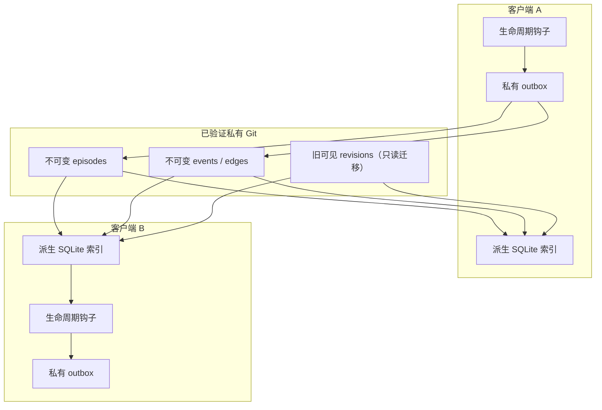
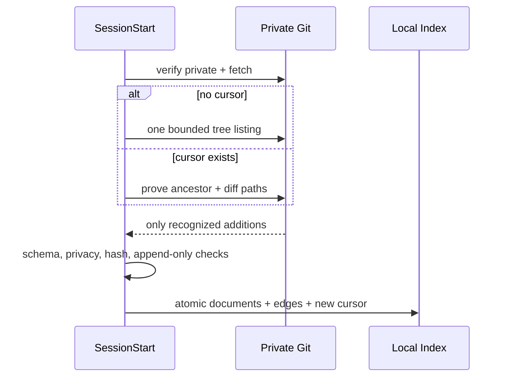
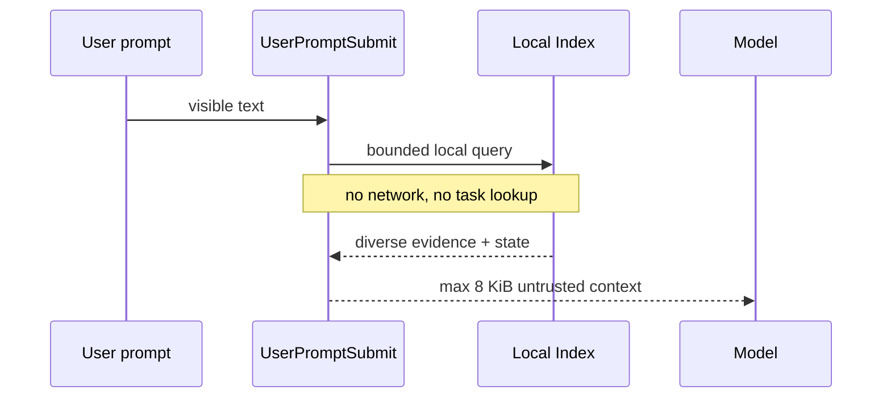
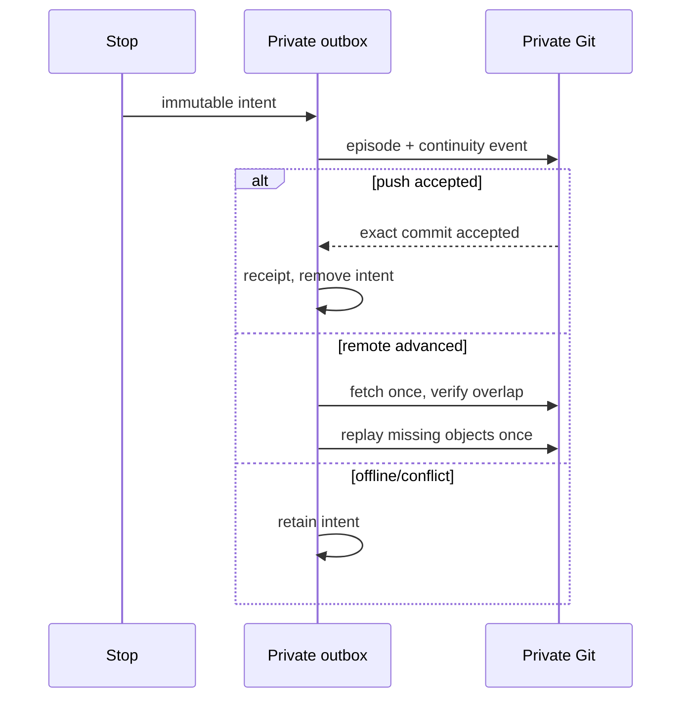

# 外部记忆网络架构

## 总体原则

记忆是独立证据与关系构成的网络，不属于任务或对话。来源提供时间和出处，AI 在读取
时判断相关性；新进度改变后续行动，但不会改写过去发生过的事实。

## 组件边界

### 生命周期入口

`hooks/hooks.json` 只负责定位并校验完整运行时文件，然后将三个事件交给
`scripts/vault_sync.py`。它不解析对话、不决定记忆归属、不运行任务匹配。

### 核心编排

`memory_vault_runtime/core.py` 负责：

- 私有远端身份验证和 Git 增量传输；
- 本地会话、提示暂存和 outbox；
- episode/event 的严格模式与隐私验证；
- 一次并发重放、完整导入导出和生命周期错误语义；
- 旧可见 revision 的单向迁移读取。

它保留的旧任务函数不属于正式接口，只供 `_test_mode` 历史兼容测试。生产配置不能
激活它们，命令解析器也不会暴露它们。

### 关联索引

`memory_vault_runtime/memory_network.py` 只依赖 Python 标准库，负责：

- 稳定 source/episode/event ID；
- 可见文本切分和 CJK/Latin 词元；
- SQLite 文档、片段、倒排词项和关系边；
- BM25 风格检索、关系状态、去重和上下文限额；
- 0.16 候选中的可解释本地词法/手写概念/图状态混合评分与确定性词法后备；
- taskless episode/event 构建。

`memory_vault_runtime/graph_views.py` 在 0.17 中提供可丢弃的 claim timeline
投影和有界关系遍历。它只消费已验证的 fragments/edges，输出 current、
superseded、conflicted、resolved 状态及关系原因；它不能写回 durable rows，
也不建立 task/conversation/device owner。该模块与其他运行时文件一样纳入
完整性清单，功能关闭时词法召回仍独立可用。

0.18 的 `packs.py`、`transport.py` 和 `checkpoint.py` 是独立的传输层：pack
逐对象压缩并保留 canonical path/hash/index，transport 只保存有界的源哈希与
断点偏移，checkpoint 只验证 taskless hash catalog。它们不能把派生 pack、
远端提交或测试 trust anchor 提升为 durable authority；生产签名密钥、首次
设备指纹分发和 Windows 实机验收仍在仓库外完成。

0.19 的 `sharing.py` 负责内容级 selector、episode/event/relation 闭包和
确定性 `memory-share-bundle/v1`；`crypto_adapter.py` 只定义外部加密提供方、
版本化密文 envelope 和解密后原子校验边界。默认提供方未配置，不能输出明文
交接包，也不能据此宣称 Git 服务器不可读。

0.20 的 `device_trust.py` 负责无任务的设备 enrollment、key epoch、未来撤销、
恢复描述符和单调状态机；`encrypted_replication.py` 只处理 opaque envelope
元数据和 ciphertext-only append-only catalog。签名、私钥、阈值恢复和第二台
实机仍由外部审核过的提供方与密钥仪式完成。

索引可以随时从远端重建，不是写入权威。

这里的“概念”是小型、确定性、手工维护的中英文概念与极性映射，不是 embedding、
向量搜索或学习模型。它只改进候选召回并提供分项标签；删除该派生层后，全部持久记忆
仍可通过词法索引读取。

### 隐私和确定性协议

`privacy.py` 检查凭据、本机路径与远端安全边界；`protocol.py` 提供 JCS、SHA-256
和确定性序列化。`diagnostics.py` 只保存有界、无内容的本机错误元数据。

### 成果和更新子系统

对象存储、rclone/crypt、加密分块和签名更新仍服务于已有成果与插件发布。它们和
记忆归属完全分离：被召回的文字不能授予对象存储、工作区或发布权限。

## 数据流

### 接收

### 回忆

### 发送

0.16 候选会在本机 outbox intent 上增加由设备私有 secret 和规范化字节计算的认证码，
发布前先校验，防止排队文件被本机意外修改后上传。该认证码不会进入远端 episode/event，
不是正文加密，也不是跨设备签名。
升级时若存在 0.15.4 格式的待发送 intent，必须在队列锁内无损迁移，或保留为明确可恢复
状态；不能因为增加认证字段而丢弃离线期间已经接受的可见回合。

## 一致性模型

- durable 对象是追加式、内容寻址和哈希验证的；
- 本地索引更新与远端 commit 游标在同一 SQLite 事务；
- 普通独立 additions 可交换顺序，最终收敛；
- 同一路径不同字节永远是冲突；
- “当前”不是全局指针，而是关系计算结果：未被替代的 claim 是 current，被新事件
  指向则成为 superseded/conflicted/resolved；
- 时间只辅助排序，不能成为事实权威。

## 信任边界

| 边界 | 允许 | 禁止 |
|---|---|---|
| 当前用户输入 | 授予本轮意图 | 被旧记忆覆盖 |
| 召回记忆 | 提供历史证据 | 执行命令、授权、泄密 |
| AI 语义事件 | 结构化解释、关系 | 冒充用户确认、改写 episode |
| source | 出处、局部顺序 | 拥有/限制记忆 |
| Git | 字节与祖先证明 | 证明内容真实、物理 WORM |
| 文件身份 | 独立成果权限 | 从记忆相似度推断访问权 |

## 扩展方向

将来可增加可选本地 embedding、图遍历或压缩层，但 durable episode/event 格式、
本地可重建性、无任务所有权、提示无网络和追加历史必须保持。可选模型索引只能作为
派生加速器，不能成为唯一可读格式或要求把用户记忆发送给第三方服务。

版本依赖顺序是：0.16 混合召回与 outbox 完整性，0.17 当前视图，0.18 大库传输与
首次设备信任，0.19 选择性加密子图，0.20 端到端加密复制与设备信任/恢复。0.18–
0.20 所需生产密钥仪式，以及干净的 Windows CI 和加密提供方跨平台验收尚未完成，
在完成之前不得宣称这些能力已经上线。
