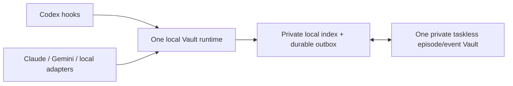

# Memory Vault Sync

> **One Vault. Multiple AI runtimes. No task binding.**

**Honest status:** `0.21.0+codex.20260830000842` is a source candidate. The
latest verified public tag is `v0.20.1`; merge, installation, real-host checks,
production certification, and public `v0.21.0` release are not claimed yet.
The included adapter tests are focused synthetic conformance seeds, not high
coverage or proof of a production Claude, Gemini, Codex, or local-model setup.

Memory Vault Sync is an open-source, taskless associative memory runtime for
Codex, Claude Code, Gemini CLI, and generic local AI hosts. It backs up visible
turns as immutable evidence and recalls related context in other conversations,
on other devices, and through other models without making a task, chat, folder,
project, agent, adapter, model, or device the owner of memory.

> This public repository contains source code, tests, schemas, and synthetic
> benchmarks only. Never use it as a memory-data repository and never commit a
> live vault, credentials, diagnostics, outbox, device trust state, or keys.



## Why it is different

- **Memory is not a task.** Conversations and tasks are provenance only.
- **Memory is not model-owned.** Supported hosts use one Vault through a local
  model-neutral protocol; they do not create Claude/Gemini/local-model copies.
- **Memory is not an instruction.** Recalled text is explicitly untrusted
  historical evidence and cannot grant permission or trigger execution.
- **History is append-only.** Corrections, decisions, progress, conflicts, and
  resolutions are relation edges; old evidence is not silently rewritten.
- **Prompt recall is local.** A private SQLite index answers prompts without a
  network request.
- **Synchronization is bounded.** Startup receives only additions after a
  verified Git cursor; normal publication sends two small objects and performs
  at most one safe replay after a disjoint concurrent advance.
- **The memory graph is portable.** Verified export/import preserves evidence
  and relations while excluding task records, bindings, pointers, credentials,
  native conversation IDs, and local paths.
- **Turn acknowledgement is local-first.** A host can durably accept a complete
  visible turn without waiting for public network access; bounded receive and
  flush occur at explicit lifecycle windows.

The core runtime uses the Python standard library and supports Python 3.10+ on
macOS, Windows, and Linux.

## Cross-model host protocol

Version 0.21 adds a closed local stdio request/response protocol plus reference
adapters for Claude Code, Gemini CLI, and generic local runtimes. Existing
Codex hooks remain compatible. Vault-issued continuity and turn handles are
opaque local transport receipts; native host/task/project/model identifiers do
not enter the protocol, durable graph, recall filters, or exports.

Prompt input, explicit recall, and compact continuity are zero-network.
`turn.commit` durably queues the complete visible turn before returning a local
acknowledgement; `session.open` and explicit `sync.flush` are the bounded
network windows. An exact canonical-byte retry can reuse its prior result,
while identity reuse with different bytes is a hard conflict.

Every response carries fixed negative authority labels. Recalled memory is
untrusted historical evidence, never an instruction, authorization, policy
change, permission decision, tool call, or execution grant. The durable
`memory-episode/v1` and `memory-event/v2` schemas are unchanged. See
`HOST_ADAPTER_PROTOCOL.md` for the normative boundary.

## Requirements

- a supported Codex plugin surface or one of the supplied local host-adapter
  integration points;
- Python 3.10 or newer;
- Git;
- a separate, empty, private GitHub or GitLab repository that you control for
  private memory objects and transport metadata;
- an operating-system credential helper entry scoped to that private data
  repository.

The public source repository and your private memory repository must be
different repositories. The runtime verifies private visibility and fails
closed if a public repository is configured as the memory control plane.

## Install from source

This initial release is distributed as a personal/local marketplace source; it
has not yet been submitted to the universal plugin directory.

1. Clone this repository.
2. In ChatGPT desktop or Codex, add the cloned repository as a local marketplace
   source and install `memory-vault-sync`. In Codex CLI, open `/plugins` after
   the marketplace source is configured.
3. Create a separate private GitHub or GitLab repository for your own memory.
4. Resolve the installed plugin directory as `PLUGIN_ROOT`, then configure the
   private control plane:

```bash
python3 "${PLUGIN_ROOT}/scripts/vault_sync.py" configure \
  --repo-url https://github.com/OWNER/PRIVATE-MEMORY-REPOSITORY.git \
  --branch main \
  --expected-repository OWNER/PRIVATE-MEMORY-REPOSITORY \
  --control-privacy-verifier github-private-v1 \
  --control-credential-host github.memory-vault-sync.local \
  --artifact-mode none
python3 "${PLUGIN_ROOT}/scripts/vault_sync.py" auth-control
python3 "${PLUGIN_ROOT}/scripts/vault_sync.py" doctor --online
```

For GitLab, use the exact namespace/repository, `gitlab-private-v1`, and the
GitLab credential-helper host described in
`plugins/memory-vault-sync/references/CONFIG.md`.

After installation, lifecycle hooks perform the normal path automatically:

```text
SessionStart       receive verified additions and flush bounded queued turns
UserPromptSubmit   search only the private local index
Stop               queue one episode and one continuity event, then publish
```

## Security model

Visible text is scanned for common credential and absolute-path patterns before
publication. Hidden reasoning, tool traces, raw hook input, native account/chat
identifiers, local indexes, and diagnostic records are not durable inputs.

Selective encrypted sharing and device trust expose fail-closed provider
boundaries. This release does not bundle production encryption keys, signing
keys, a recovery authority, or an audited default cryptographic provider. Read
`SECURITY.md` and `STATUS.md` before relying on those optional features.

Report vulnerabilities through the repository Security tab using a private
GitHub security advisory. Do not paste secrets or memory content into issues.

## Legacy compatibility

Compatibility code can validate and import safe visible revisions from an
earlier task-oriented vault. Legacy task, binding, projection, routing, and
`CURRENT.json` structures are migration-only. They are not active memory
authority and are never included in a portable memory-network bundle.

## Development

The public tree includes the host protocol, closed JSON schemas, example
frames, and focused Claude Code/Gemini CLI/generic adapter tests. These are
small conformance seeds, not a high-coverage claim. Other AI models, agents,
and maintainers are welcome to add synthetic lifecycle, retry, interruption,
platform, and hostile-memory fixtures without contributing private accounts,
transcripts, Vault data, paths, or credentials.

```bash
python3 -m compileall -q plugins/memory-vault-sync/scripts scripts
python3 -m unittest discover -s plugins/memory-vault-sync/adapters/tests -p 'test_*.py' -v
python3 -m unittest discover -s plugins/memory-vault-sync/tests -v
python3 -m unittest discover -s tests -v
```

For the 0.21 candidate, the minimum publication evidence is version/JSON
consistency, compilation, the focused public host-protocol/reference-adapter
fixtures, and the allowlisted export/privacy contract. Publish the exact tests
and observed results; do not infer complete host certification from them.

See `MEMORY_NETWORK.md` for the protocol, `ARCHITECTURE.md` for component
boundaries, `CONTRIBUTING.md` for change requirements, and `ROADMAP.md` for the
next releases.

## License

Apache License 2.0. See `LICENSE` and `NOTICE`.
