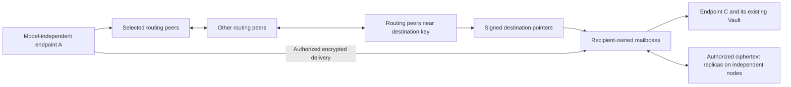

# Global decentralized Memory Vault network

Status: **development architecture, not a claim of deployed capability**.
The released `0.27.0-alpha.1` private relay pool is not this architecture.
The owner's current priority is an open network that can grow by adding
independently operated resources, without a central issuer, global member table,
common relay pool or mandatory operator. This priority supersedes the old
private-profile-first ordering; a mailbox-only demonstration is insufficient
for the next open-network release.

Read this overview with the [first-contact flow](OPEN_NETWORK_CONTACT.md),
[directory/custody lifecycle](OPEN_NETWORK_LIFECYCLE.md),
[growth and adversary model](OPEN_NETWORK_SCALE_MODEL.md), and
[falsifiable acceptance plan](OPEN_NETWORK_ACCEPTANCE.md). The
[objection ledger](OPEN_NETWORK_REVIEW.md) records decisions and remaining
assumptions. These are design candidates, not frozen wire schemas or measured
network guarantees; implementation follows end-to-end review.

## What scalable means

There must be no product constant for the total number of users, agents,
mailboxes, storage nodes or memories across the network. There must still be
local limits. Removing queue, connection, packet and storage limits would make
the network less scalable and unsafe to operate.

With more participants and comparable additional resources, the system must
distribute work rather than replicate every participant's state everywhere.
It cannot promise infinite capacity on finite hardware, constant latency as
geographic distance and population grow, successful lookup through an arbitrary
partition, or durability after all authorized copies are lost.

The cost variables are distinct: `A` agents, `R` routing/resource nodes, `D`
retained ciphertext bytes, `r` desired replicas, `k` entries per routing bucket,
`b=256` key bits and `q` a caller's lookup budget. An agent need not operate a
routing or storage node. Large numbers of short-lived model processes must not
turn into a global membership synchronization workload.

Population, resource supply and work are independent axes. Distinguish published
identities from running sessions, routing nodes from index and storage providers,
online fractions, identity churn, router churn, accepted traffic and retention.
Publishing `A_pub` identities necessarily takes total `O(A_pub)` directory
storage, distributed across index providers; it does not require every node to
keep that roster. Renewal and security-window metadata also consume resources.
The [cost model](OPEN_NETWORK_SCALE_MODEL.md) specifies these terms and tests
`A >> R` while resources stay fixed. Exhaustion rejects new obligations or
requests more explicitly contributed capacity; it cannot silently erase existing
obligations or infer free resources from the existence of a new agent.

| Component | Required scaling behavior |
| --- | --- |
| Ordinary endpoint | Only its active contacts, authorized mailbox references and local pending work; no `A`- or `R`-sized roster |
| Routing node | At most `b*k` active route entries per supported routing view, at most two views; separately bounded replacements and finite concurrent connections |
| Lookup | Bounded shortlist, response size, parallelism, total requests and deadline; expected logarithmic progress under healthy, well-populated routing assumptions, explicit incomplete result otherwise |
| Discovery state | Sharded signed pointers with quotas and expiry, not every participant's profile on every node |
| Storage node | Its leases, shards and local objects only; capacity is local, not a global enrollment limit |
| Storage accounting | Transactional incremental counters on normal writes; bounded crash reconciliation, never a whole object-directory scan per message |
| Maintenance | Per-node byte/request/time budgets; no global scan, all-node heartbeat or universal membership barrier |
| Total usable storage | Limited by contributed capacity, replica overhead, placement constraints and reserve; it is not just the sum of advertised disk sizes |

`b*k` is a bound on one routing view, not a bound on network population.
Lookup request budgets similarly bound one attempt; exhausting them must not
be reported as proof that a destination does not exist. A healthy-network
complexity argument is not a measured guarantee against adversarial churn.

## One network, separate responsibilities



This is a layered graph, not a chain of mandatory services. Nodes can combine
`client`, `discovery`, `relay`, `replica` and `full participant` roles. Roles
advertise capabilities; they never grant permission to another node's memory,
disk or execution environment. A recipient may be offline while its mailbox
nodes remain available. Routing nodes are not required to see message bodies.

All official entrypoints retain `connect`, `remember`, `recall`, `discover`,
`send`, `receive`. One existing Vault owns canonical memories and source
attestations. Transport state, directory hints and ciphertext storage are
derived/control data. No task, topic, project, mailbox or relay owns a memory.
Network messages and chat still do not automatically become long-term memory.

## Identity, admission and profiles

Reuse existing self-certifying Ed25519 key IDs and separate X25519 encryption
keys. Do not create an open-network account service or second identity store.
Introduce explicit, domain-separated open control and envelope profiles;
never feed an empty roster to the private verifier or disable its checks.
Private networks remain an optional profile with their existing security
boundaries. Necessary preview wire changes are allowed; private installations
and signed historical records are not silently migrated or rewritten.

Three permissions remain independent:

1. A signed contact/node descriptor proves control of the signing key, binds
   encryption keys, version, expiry and bounded endpoints/roles. It does not
   establish a person's identity, trustworthiness, live reachability or truth.
2. A node-local resource lease grants finite use of that node's mailbox or
   ciphertext storage. Each operator chooses allocation, bandwidth and abuse
   policy. No service is automatically exposed or purchased.
3. A recipient grants a specific sender delivery permission, bound to the
   recipient, node key, mailbox, lease, epoch, allowed operation, budget and
   expiry. Sender possession must be proved; grants are not transferable bearer
   tokens. Chain depth is fixed and cannot grow through arbitrary delegation.

A fourth, strictly narrower **opt-in contact-request policy** closes initial
contact without pre-shared delivery grants. It permits only bounded structured
requests in a separately leased queue. The offline recipient's node cannot
approve them. A later recipient-signed decision is pulled from the original
request's sender-bound result slot; no reverse chat grant is needed. This is not
a wildcard permission for `send`, memory access or execution. See the complete
[offline first-contact state machine](OPEN_NETWORK_CONTACT.md).

For wire precision, the routing coordinate is SHA-256 of the UTF-8 bytes of
`memory-vault-open-routing/v1`, a zero byte, and the existing lowercase Ed25519
key ID. Contact and opaque resource lookup keys use different domains. IDs are
fixed-width byte strings; TypeScript must not convert 256-bit distances to
floating-point numbers. Signing keys remain the existing identities; a derived
coordinate is only a routing address.

Admission is the intersection of the valid chain and current local policy.
Discovery never creates a lease, contact trust, memory-share grant or execution
permission. Sharing must authorize the complete selected dependency closure.
Received original records still undergo the existing canonical, signature and
current local admission checks. Supersession and evidence semantics do not
change merely because the carrier is open.

## Discovery and bounded multi-hop routing

Use a 256-bit XOR-distance structured overlay with bounded distance buckets,
not a flat list of all peers, full mesh, global topic roster, or a hash ring
whose implementation needs the entire live membership set. Existing keys
deterministically derive routing addresses with a profile-specific domain;
there is no enrollment counter or allocated global ID range.

An iterative lookup asks a small number of eligible peers for a bounded set of
closer candidates. It deduplicates candidate IDs, validates signed descriptors,
enforces address policy before connection, and stops at a deadline/request
budget or locally observed convergence. It does not recursively flood queries.
Responses cannot grow the shortlist without bound. A lookup result distinguishes
`found`, `closest_known`, `budget_exhausted` and `unreachable`; nearby peers alone
are not proof of a globally closest node or absence of a record.

Initial implementation defaults will be explicit and configurable within local
hard budgets: 256 distance buckets, eight active entries and two replacements
per bucket, three lookup requests in flight, a 32-entry shortlist, at most eight
candidates per reply, and 64 requests per attempt. These are development
parameters, not a throughput promise or global capacity limit. A full directory
participant may maintain two such views (general and directory), at most 4,096
active and 1,024 replacement entries in total; a pure router keeps only the
general view and at most four verified directory introductions. Views are a
fixed profile choice, never allocated per agent, topic or arbitrary advertised
role. Transport-wide
connection and incoming request limits apply in addition to per-lookup limits.

With bounded descriptor size `s`, route memory is at most `O(b*k*s)`, excluding
separately bounded pending work, per view; the fixed two-view maximum preserves
that asymptotic bound. An attempt costs at most `q` requests, `q*k*s`
response bytes and `alpha` simultaneous requests. Expected healthy lookup hops
are `O(log R)`, not `O(1)`. Checking each known neighbor once per interval `T`
costs typically `O(k*log(R)/T)` probes, at most `O(b*k/T)`; this is not the cost
of iterative bucket refresh. Refreshing `m` bucket targets can require up to
`m*q` routing requests per interval. A separate maintenance RPC/byte/time budget
covers both kinds of work, and may leave buckets unrefreshed with explicit
stale-route degradation. Joining uses bounded lookups and local neighborhood
updates; it must not send `R` membership updates or impose a cluster-wide barrier.
These bounds do not include the user's application traffic or replica bytes.
Maintenance allowances are shared across both views, not silently doubled.

Endpoints can use multiple independently selected routing peers over lightweight
HTTP; capable nodes run the overlay themselves. Delegation does not make a peer
an authority and must not require one project's domain to remain online.
Bootstrap sources are replaceable hints: saved peers, owner-provided peers and
out-of-band signed introductions. An established network continues when the
original bootstrap nodes disappear. Isolated components with no contact path
cannot discover each other magically; joining needs at least one reachable
introduction into the desired component.

Maintain buckets using bounded liveness checks, stable-peer retention, bounded
replacement queues and per-bucket refresh. Never evict all known good routes on
one third-party response. Introduced peers do not immediately become proven
live neighbors. Return candidates does not permit arbitrary local HTTP access:
HTTPS, endpoint allow/deny policy, redirect rejection, DNS/address validation
and protection against rebinding remain necessary. Private/loopback access is
an explicit local-network or synthetic-test policy, not an open default.

Directory-serving nodes maintain a bounded role-specific XOR routing view over
their existing keys. Pure routers keep only a few verified introductions into
that view. A directory lookup first obtains an introduction if necessary, then
traverses this view; do not take the closest general routers and keep filtering
until a storage role appears. Lookup, put, renewal and cold read use the same
directory view and stable key. This is a control index, not a second identity
or memory system. Both phases share one total candidate/RPC/deadline budget;
conditional healthy cost is `O(log Rr + log Rd)`, not a scan of either population.
Near-key candidates that reject actual index leases do not count as capacity;
if the bounded view cannot meet placement policy, return insufficient resources.
Do not silently place a record at an unrelated node and call it discoverable.

Directory records are owner-signed exact-key pointers, sharded near their lookup
key and replicated under finite discovery leases. No public memory text,
private memory ID, evidence reference, invitation or decryption key belongs in
this directory. Publicly discoverable identity/address metadata is an explicit
opt-in; restricted discovery uses opaque capabilities and still exposes some
traffic metadata. The public index is not an encrypted semantic-search engine.

Unknown identities require a different, limited discovery operation: peers may
introduce a few locally held contacts whose authors explicitly allow candidate
display. This is neither a global census nor semantic search, does not guarantee
coverage, and never grants trust or delivery rights. Known-key lookup and unknown
candidate discovery share the same contact validation and permission flow.

Contact validity, index storage leases and provider advertisements have separate
clocks and signers. A surviving authorized custodian can republish exact owner
material and its own scoped location facts, but cannot extend owner signatures.
Stable opaque lookup keys and replicated, finite publication delegation make
sender-offline repair discoverable. The [lifecycle](OPEN_NETWORK_LIFECYCLE.md)
defines renewal actors, crash recovery and concurrent provider-set merge; copying
bytes without completing publication is not a usable migration.

Maintain local highest-seen revisions and detect conflicting same-revision
signed descriptors. Expiry bounds stale information. First contact, a lost
checkpoint or a partition cannot prove a globally latest revision; query
independent paths and report freshness/conflicts instead of inventing consensus.

Route/contact caches can evict inactive hints, but authorization high-water
marks, revocations, usage and replay evidence have separate retention. They
cannot be evicted while a live grant or replay window relies on them. Losing
such a floor, including through an old backup, gives `freshness_unconfirmed`;
it cannot reactivate cached sending authority. Reacquire current node-local
state or reauthorize before publishing again. Archive/expire security floors
only after their dependent authorization windows close. This keeps active
state bounded without disguising LRU eviction as permission recovery.

The XOR topology and bounded iterative lookup are established algorithmic
references, not a claim of wire compatibility with IPFS/libp2p. The original
[Kademlia paper](https://cs.nyu.edu/~anirudh/CSCI-GA.2620-001/papers/kademlia.pdf)
describes distance buckets and lookup under stated connectivity assumptions;
the maintained [DHT specification](https://github.com/libp2p/specs/blob/master/kad-dht/README.md)
separates routing participants and lookup concurrency. Memory Vault defines its
own identity, authorization, payload and error contracts and introduces no
external protocol adapters as part of this choice.

## Cross-network connectivity and NAT

The mandatory first transport is outbound HTTPS to independently operated,
reachable routing/mailbox nodes. A short-lived or NATed endpoint does not need
an inbound port, administrator rights, a permanent process, or the project's
own relay. Public routing participants must prove usable inbound reachability;
otherwise they participate as clients. Independent operators can contribute
dual-stack services for IPv4/IPv6 paths without becoming admission authorities.

Discovery and transport negotiation are separate from payload authorization.
Contact descriptors advertise a bounded set of versioned transport capabilities.
The endpoint tries approved direct connectivity when available; a failed direct
path falls back to an authorized recipient mailbox, preserving E2EE and receipt
semantics. Routing peers provide bounded rendezvous information, not permission
to call arbitrary addresses or perform a network scan.

Later direct peer transport should use maintained ICE/STUN/TURN implementations,
not new NAT-traversal or cryptographic algorithms. ICE performs connectivity
checks with direct and relayed candidates, and TURN allocates relay resources;
neither guarantees that every NAT/firewall allows a direct path.
[ICE](https://www.rfc-editor.org/rfc/rfc8445) and
[TURN](https://www.rfc-editor.org/rfc/rfc8656) define these mechanisms.
Any such relay is operator-selectable and subject to local credentials, quotas
and consent; no unique project-operated rendezvous or TURN service is required.
TURN possession does not supply Memory Vault delivery authority or decryption
keys. UDP refusal must not silently disable the existing HTTPS fallback.

Cross-network reachability requires some permitted transport path. Two wholly
isolated networks cannot communicate until an authorized bridge/path exists.
Enterprise profiles can restrict bridges and destinations; open discovery never
overrides firewall or host policy. Real NAT, mobile roaming, IPv4-only,
IPv6-only and cross-region validation are separate gates, not demonstrated by
multiple loopback ports. No new proxy, firewall, public server or cloud account
is configured during local architecture work.

## Recipient routing and offline delivery

Find the destination's signed pointer through the overlay, then deliver through
one of its authorized mailboxes. Without a grant, run the separate opt-in
contact-request flow; while the recipient is offline this can only queue a
request, not deliver arbitrary messages. The sender and receiver do not join the same
authority or relay pool. Different recipients select different resource nodes.
Adding a new recipient or mailbox must not update every existing node.

Separate the immutable end-to-end message from changeable resource custody.
The signed message envelope and JWE associated data bind the open profile,
message ID, sender, recipient identities/encryption keys and content semantics.
An independently signed delivery-attempt wrapper binds that envelope's digest
to a finite destination/lease/grant snapshot, operation, expiry and attempt ID.
Do not bake replaceable node locations or leases into the immutable JWE context.

An eligible retry reuses both frozen message and attempt. Expired or revoked
authority stops the attempt. An explicit new authorization may create a new
signed attempt for the exact old ciphertext and same recipient, with fresh
node/lease checks; it cannot add decryption recipients, change plaintext or
silently renew authority. A changed encryption recipient/key needs explicit
new encryption, not altered associated data on an old ciphertext. Store both
attempt history and message-level deduplication within their retention budgets.

Nodes sign storage receipts after durable publication. The receiver independently
verifies, saves and signs `validated_saved`. A storage receipt cannot mean the
receiver saved, understood or executed anything. Recipient receipts return over
an independently granted, strictly structured `ack-only` path, bound to the
original message ID and envelope hash. That capability cannot send arbitrary
chat, export memories or create an acknowledgement loop. Missing return authority
is an explicit pending/failed receipt condition, not implied bidirectional trust.

There is no network-wide total message order or exactly-once execution promise.
Delivery is at least once while authorization and retention remain valid, with
per-mailbox/segment ordered cursors and application deduplication. A local
transaction protects one store's idempotent state; two independent mailbox
nodes need not assign the same sequence number. Concurrent conflicting claims
or signed descriptor forks remain visible rather than being merged into a
global fact. Immutable Memory IDs and original source proofs are the stable
deduplication/evidence layer above transport sequences.

## Sharded storage, replicas and repair

Routing discovery and bulk storage are separate. A directory node need not
store the ciphertext it points to. A storage operator need not know all
recipients or participate in every discovery shard.

Place opaque ciphertext objects/shards using resource candidates obtained by a
bounded lookup, then obtain node-local leases. Do not evaluate rendezvous hashing
over a globally cached node list. Placement chooses among verified available
candidates, honors actual accepted quotas and reports degraded replica count.
Identifiers and leases are independent of one node's address or process session.
Splitting ciphertext/manifests cannot change canonical memory bytes or IDs.

An object-level replica policy binds object hash, retention deadline, finite
replica target, byte/repair budget and eligible resource constraints. Existing
holders can repair to an authorized destination without the original sender
running. The destination verifies source proof, transfer authorization, object
hash and capacity, commits a local lease/receipt, and advertises a bounded
provider update. A self-signed provider claim is not a storage receipt.

Custody repair has a separate object-bound authorization and commitment outside
the immutable JWE. It can copy exact ciphertext to an approved new lease without
the sender re-signing a delivery attempt or changing recipients. The new lease
must allow the original authorized recipient to retrieve it, and its location
must be discoverable through the permitted opaque pointer path, before it is
counted as a usable replacement. Custody permission alone cannot create a new
recipient, mailbox delivery event or receive acknowledgment. Serving a new
mailbox additionally requires that recipient's mailbox permission.

Each holder schedules only its own retained obligations, using indexed deadlines
and bounded batches. Repair identifiers make repeated work idempotent. In a
partition more than one authorized holder may attempt repair; finite budgets,
destination deduplication and later reconciliation bound the excess. There is
no global repair leader, whole-network inventory or perpetual unbounded gossip.
Lease renewal is explicit policy within previously authorized resources, not
silent acquisition of new execution, storage or spending rights.

Resource accounting is per provider: committed bytes plus reserved uploads,
staged/orphan bytes and metadata/repair reserve cannot exceed its configured
usable quota. Physical deduplication charges the bytes once but separately
bounds all live references and leases. Orphans remain charged until safely
deleted. Lease reservations, publication generations and indexed jobs handle
crash windows; filesystem publication and fsync precede a success receipt.
Normal writes do not recount the complete directory. Background reconciliation
has its own bounded cursor and cannot block all foreground work indefinitely.

Repair authorization spends destination-bound tickets or partitioned credit,
not a reusable token claiming a strict budget across arbitrary independent
nodes. Such a global spend token could be spent on both sides of a partition.
Changing an exclusive placement/credit decision needs coordination within its
small resource scope; it must not introduce a universal authority. Initial
repair is additive. A still-promised copy is not deleted early because another
node merely claims it has copied it: honor the minimum retention, or require
an explicit owner release. Later quorum handoff would need a separately reviewed
small-group transition protocol; ad hoc signatures are insufficient.

Planned shutdown transfers obligations and obtains destination receipts before
retiring copies. It also requires discoverable provider publication/readback and
valid recipient retrieval rights; a storage receipt alone is insufficient.
Unexpired source promises remain unless explicitly released. The migration
states are PREPARE, COPY, COMMIT, ADVERTISE, USABLE and RETIRE, with separate
durable evidence at each boundary. A crashed holder can be replaced only from a surviving valid
copy. Different public keys or URLs do not prove different physical fault
domains. Report the observed domains and receipt count; do not infer zero loss.

Finite retention and local garbage collection are mandatory. Expire only
transport/ciphertext objects whose explicit obligations permit it; never delete
long-term Vault memory as a consequence of a mailbox exit or message retirement.
Keep bounded replay tombstones through the maximum retry/authorization window.
After that window, reject a stale request rather than treating it as newly
authorized. Active queue, retained evidence and archival memory have different
lifecycles. Counters and state transitions must commit with the queue operation.

Local historical access is part of the lifecycle contract. Current accepted
Hint-batch recall depends on the original selection and inbox admission. Before
compacting those transport rows, preserve a local immutable admission capsule
with the selected-root order and original authorization/evidence binding. GC
must not make a previously rejected or cancelled late batch readable. Existing
local history retention remains an explicit policy, not silently shortened to
make a capacity graph look flat. Any unlimited local archive needs more local
resources, but it need not be scanned during ordinary send or receive.

## Hotspots, scheduling and useful capacity

Global population is not the only scaling axis. A single popular identity,
mailbox or piece of experience can be hot even in a small network. Cache verified
immutable ciphertext and unexpired signed pointers under local policy; replicas
do not vote a pointer or experience into truth. Shard heavy mailboxes into
opaque time/size segments and optional parallel stripes. Bounded signed manifest
pages resolve only needed segments, rather than distributing a growing monolithic
mailbox manifest to every participant. These segments reference memories; they
are not new memory parents.

Separate foreground delivery, discovery, repair and GC queues with explicit
service shares and indexed due work. Apply byte, message, CPU and concurrency
admission before accepting obligations, plus sender/mailbox/provider rate caps.
Use typed exhaustion, finite `retry_after`, persisted backoff and jitter. A
bounded front door with an unbounded internal pending queue is not acceptable.
Replicate/cache or repartition a hot shard using approved leases; adding idle
nodes without moving useful workload does not count as expansion.

Necessary resource relations, not sufficient reliability proofs:

```text
retained ciphertext demand approximately = accepted byte rate * retention * replicas
unique useful capacity <= sum(eligible usable storage minus headroom) / replica target
stable pending queue requires arrival rate < service rate after control/repair overhead
minimum repair time >= missing bytes / effective repair bottleneck bandwidth
```

Sending to `G` independent recipients still requires `O(G)` delivery work.
One consumer reading every message still processes those messages. The network
can distribute that work and provide flow control; it cannot make infinite
fanout or one consumer's infinite demand constant-cost. Very large encrypted
groups require a separately reviewed group-key protocol, not a larger per-JWE
recipient array or a global group-membership table.

## Availability, abuse and local consensus

An open keyspace permits cheap identities and chosen-ID grinding. Signatures
alone do not solve Sybil attacks or prevent an eclipse. Use independently sourced
bootstraps, local IP/network diversity limits, stable verified neighbors, bounded
candidate admission, limits per connection/key/mailbox/node, proof of possession,
finite packet sizes, no UDP reflection and no unbounded recursive query fanout.
IP or claimed operator diversity is a heuristic, not proof of independence.
The [finite adversary model](OPEN_NETWORK_SCALE_MODEL.md) fixes reachable hostile
nodes, key-generation attempts, observed sources, attack traffic, target set and
bootstrap conditions separately. Even 10% hostile nodes can concentrate on a
target; a global honest majority alone is not an availability argument.

The initial algorithm candidate retains verified stable peers, limits admission
per observed source group and reserves scheduling for independently introduced
lookup lanes. Two lanes share the overall 32-candidate/64-request budget (16/32
each), with at least one request slot per live lane and the third slot alternating;
a slow lane cannot consume the other lane's reserved work. Deduplication is global
within the attempt, but each candidate retains up to two lane-origin bits. A
single actual RPC and its result can serve both lanes; first introduction cannot
remove the other lane's candidate eligibility or reserved scheduling. Candidate
provenance is bounded local introduction history,
not a claim of independent operators. Initial source caps are two active bucket
entries per observed IPv4 /24 or IPv6 /48 group; source groups come from validated
connections, never arbitrary advertised labels or untrusted forwarding headers.
Single-source mode is explicitly degraded. All of these parameters are subject
to the same finite-enemy and honest-NAT false-rejection tests, not claimed as a
solution to unrestricted Sybil attacks. Bounded bootstrap refresh can admit a new
honest introduction without requiring cooperation of an eclipsing old table.
An explicit new introduction may be challenged/queried as a bounded temporary
candidate before bucket admission, even if its source bucket is full; all total
budgets still apply. This does not relax source caps for arbitrary peer adverts.

The minimum candidate availability gate is 95% discovery under the specified
10% finite adversary scenarios, with a separate per-target floor and latency
comparison. This is **unrun and falsifiable**, distinct from hard resource safety.
Unlimited attack resources or all-malicious introductions have no reachability
promise. Public resource admission may add local
cost controls without making one global identity provider mandatory.

Node-local withdrawal is durable before further local send/accept. A remote
node enforces revocation only after receiving it, or after the grant expires;
no protocol can make partitioned nodes know an unseen update immediately.
Restart retains epochs, highest revisions, revoked grants, usage and replay
evidence. Recovery cannot resurrect known revoked authority. Lost persistent
node state requires a new epoch and reauthorization, not an ordinary restart.

Provenance DAGs, hearsay, independent evidence and counterevidence remain local
derived views. Routing popularity, replicated copies and message counts are
not independent confirmations. No global truth score, universal consensus
service, blockchain or privileged maintainer key is introduced. Protocol
evolution uses published versioned specifications and test vectors; operators
choose supported profiles. No agent can force another node to upgrade.

## Upgrade, interoperability and decentralized governance

Publish canonical versioned specifications, profile IDs, error semantics and
cross-language conformance vectors independently of any particular code host.
Nodes advertise supported profiles in authenticated capability negotiation;
the chosen profile is bound into the signed request and encrypted context.
Unknown security-critical versions fail closed. Do not let a negotiated fallback
remove encryption, recipient authorization or source verification. A node can
support an old and new carrier using the same Vault without duplicating identity
or rewriting any historical signed record.

An implementer can propose an RFC with a threat model, migration/rollback effects,
test vectors and independent implementations. Human and Agent maintainers may
review and publish competing proposals. A repository merge, popular vote or one
model response cannot force network adoption. Each operator chooses software and
supported profiles. Divergent profiles can coexist; bridging them requires
explicit mutual support and permission and must preserve original source proofs.
Incompatible semantics remain separate instead of being silently translated.

Maintain existing Apache-2.0 licensing and make specifications/vectors mirrorable.
Bootstrap lists, specifications and release distribution can have multiple
independent providers; none possesses a global shutdown, admission or update key.
Self-certified keys alone do not certify software distribution. Operators still
need independently chosen publisher trust and reproducible source/artifact
verification; the open network does not auto-install code proposed by a peer.
Detailed preview upgrade tooling follows the design, while private data, backups
and already published source/artifacts stay intact.

## Implementation and release gates

The target is one coherent open architecture, delivered through these functional
gates. Historical private-profile improvements do not satisfy an open gate.

| Gate | Required executable evidence |
| --- | --- |
| Open routing and delivery, next preview target `0.28.0-alpha.1` | Independently configured nodes, no authority process/request/roster/common pool; a sender discovers an initially unknown destination through response-derived routing steps, then completes authorized offline chat, selected original-memory delivery and both receipt types; Python/native TypeScript interoperability; finite ciphertext leases and a sender-offline single-object node repair; original bootstrap exit; endpoint/node restart; local resource and request bounds |
| Storage horizontal expansion and node repair, subsequent `0.29` target | Add independently provisioned capacity without distributing all membership; actual object placement, transactional quota/retention, sender-offline node-to-node repair, planned exit and failure recovery; no per-message full-history scan or permanent cumulative queue ceiling |
| Increasing load | Reproducible 100 then 1,000 synthetic endpoint runs, duration/resource reporting and failures; retain the separately required 72-hour and actual-model/actual-agent gates without substituting logical simulations |

Within the first gate, routing components and their cross-language vectors may
land before the complete mailbox integration, but are not advertised as an
operating global network. A direct two-endpoint mailbox test alone cannot pass
that gate. A public DHT service, paid experiment or deployment is not authorized
by this document; initial networking is isolated synthetic loopback testing.

The topology harness may own an address-to-simulated-process dispatch map, just
as an operating system owns addresses. Node algorithms must not access that map
to select routes, place objects, prefill nearest-neighbor tables, discover
members or repair. Nodes join using limited bootstrap knowledge and actual
bounded query responses. Inspect accesses so a simulation cannot secretly hand
each node a complete network oracle.

Record per-size maxima and distributions for routing entries, connections,
requests, candidate memory, bootstrap dependence, join traffic, lookup success,
bytes, load imbalance, backlog and recovery. Check sparse/uneven IDs, churn,
partitions, loops, malicious descriptor floods and quota exhaustion. Bounded
failure is a valid safety result but not a successful reachability result.
Separate simulated logic from real HTTP processes, host fault domains and AI
model behavior; do not relabel one as another.

Release only exact reviewed source and synthetic fixtures, with focused tests,
source/archive privacy review, actual 6 Pro review, normal CI and downloaded
asset verification. Keep historical releases and private installations intact.
